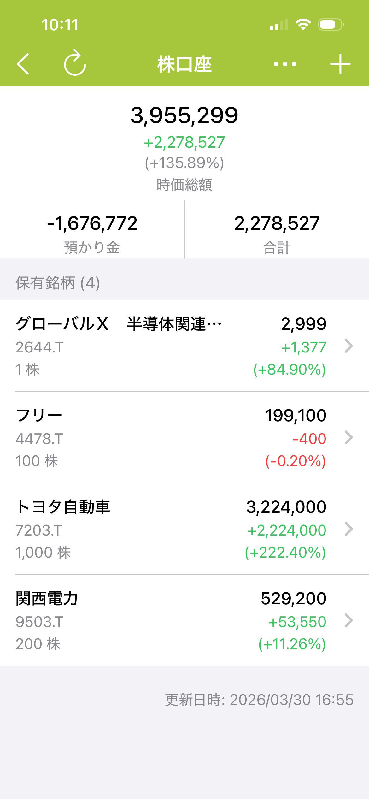

# 株式資産管理 利用ガイド

> 対応バージョン：8.0 以上

株式資産管理の主な機能：

1. ポジション管理 — 買い・売り・配当取引を記録し、各保有銘柄の状況を簡単に把握。
2. 損益レポート — 保有銘柄の損益や実現損益を自動で計算し、投資パフォーマンスを分析。
3. 株価の自動更新 — 毎日の終値確定後に、最新の市場価格を自動で取得します。米国株・日本株・香港株など、複数の市場に対応。
4. 資産統計 — 株式資産を他のアカウントと合わせて総合的に管理。資産の割合や構成を一目で把握。\
   

## 使用ガイド


[jian-li-gu-piao-zhang-hu.md](guides/jian-li-gu-piao-zhang-hu.md)



[xin-zeng-chi-gu.md](guides/xin-zeng-chi-gu.md)



[ji-lu-jiao-yi-mai-ru-mai-chu-gu-li.md](guides/ji-lu-jiao-yi-mai-ru-mai-chu-gu-li.md)



[jie-suo-gong-neng.md](guides/jie-suo-gong-neng.md)


### FAQ


[gu-jia-shi-zi-dong-geng-xin-de-ma.md](faq/gu-jia-shi-zi-dong-geng-xin-de-ma.md)

