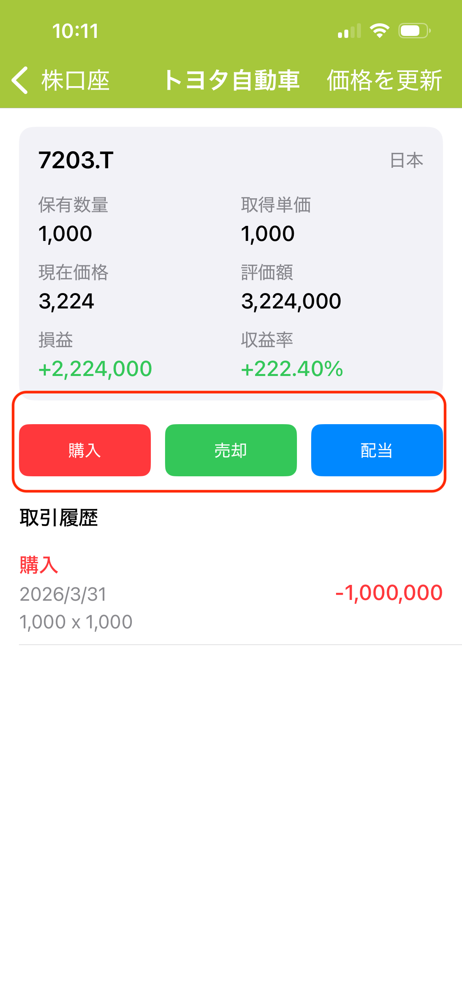

---
metaLinks:
  alternates:
    - >-
      https://app.gitbook.com/s/Hseb2PqmAac4uS7KJtxo/faq/yi-gou-mai-dan-huan-shi-wu-fa-geng-gai-wei-icloud-yun-zhang-ben
---

# 株価は自動更新されますか？

毎日家計簿では、米国株・日本株・香港株など、複数の市場の株価の自動更新に対応しています。  
口座画面を開くと、自動的に最新の株価に更新されます。  
また、株式口座の詳細画面左上にある「更新」ボタンをタップすることで、手動で最新の価格を取得することも可能です。
\
